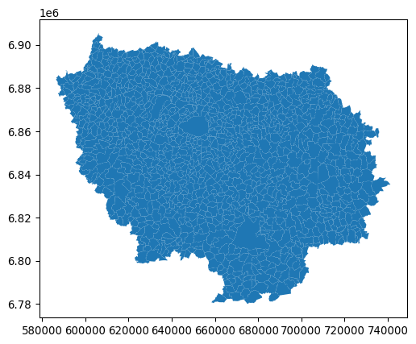
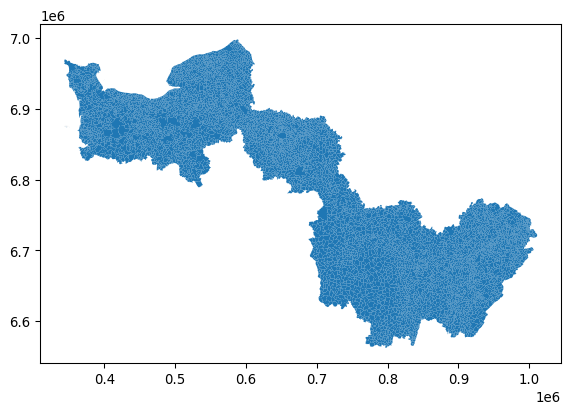

cartiflette
================

`cartiflette` est un projet pour faciliter l’association de sources
géographiques en proposant des récupérations facilitées de coutours de
cartes officiels.

## Installation

A l’heure actuelle, `cartiflette` est structuré sous la forme d’un
`package` :package: `Python` :snake:. Ceci est amené à évoluer pour
faciliter encore plus la récupération de contours grâce à des API.

Tout ceci est donc amené à bien évoluer, n’hésitez pas à revenir
fréqumment sur cette page.

``` python
pip install requests py7zr geopandas openpyxl tqdm s3fs PyYAML xlrd
pip install git+https://github.com/inseefrlab/cartogether
```

Pour tester le package, vous pouvez tenter de récupérer le contour des
communes de la région Normandie:

``` python
import cartiflette.s3

normandie = cartiflette.s3.download_vectorfile_url_all(
    values = "11",
    level="COMMUNE",
    vectorfile_format="geojson",
    decoupage="region",
    year=2022)

normandie.plot()
```

    Downloading: : 0.00iB [00:00, ?iB/s]

    Downloading: : 7.10MiB [00:00, 74.4MiB/s]

    Downloading: : 15.1MiB [00:00, 79.8MiB/s]

    Downloading: : 23.2MiB [00:00, 82.1MiB/s]

    Downloading: : 31.0MiB [00:00, 83.0MiB/s]

    <AxesSubplot: >



ou des régions Ile de France, Normandie et Bourgogne

``` python
regions = cartiflette.s3.download_vectorfile_url_all(
    values = ["11","27","28"],
    level="COMMUNE",
    vectorfile_format="geojson",
    decoupage="region",
    year=2022)

regions.plot()
```

    Downloading: : 0.00iB [00:00, ?iB/s]

    Downloading: : 6.21MiB [00:00, 65.1MiB/s]

    Downloading: : 12.4MiB [00:00, 65.2MiB/s]

    Downloading: : 18.7MiB [00:00, 65.1MiB/s]

    Downloading: : 25.3MiB [00:00, 66.9MiB/s]

    Downloading: : 31.0MiB [00:00, 69.3MiB/s]

    Downloading: : 0.00iB [00:00, ?iB/s]

    Downloading: : 8.46MiB [00:00, 88.7MiB/s]

    Downloading: : 16.9MiB [00:00, 75.6MiB/s]

    Downloading: : 26.1MiB [00:00, 84.2MiB/s]

    Downloading: : 35.5MiB [00:00, 89.4MiB/s]

    Downloading: : 44.1MiB [00:00, 87.2MiB/s]

    Downloading: : 52.7MiB [00:00, 88.1MiB/s]

    Downloading: : 61.2MiB [00:00, 73.0MiB/s]

    Downloading: : 68.5MiB [00:00, 73.9MiB/s]

    Downloading: : 77.3MiB [00:01, 78.8MiB/s]

    Downloading: : 86.4MiB [00:01, 83.7MiB/s]

    Downloading: : 91.2MiB [00:01, 81.3MiB/s]

    Downloading: : 0.00iB [00:00, ?iB/s]

    Downloading: : 8.24MiB [00:00, 86.4MiB/s]

    Downloading: : 18.0MiB [00:00, 95.5MiB/s]

    Downloading: : 27.7MiB [00:00, 98.6MiB/s]

    Downloading: : 37.4MiB [00:00, 100MiB/s] 

    Downloading: : 47.1MiB [00:00, 101MiB/s]

    Downloading: : 56.9MiB [00:00, 101MiB/s]

    Downloading: : 66.6MiB [00:00, 102MiB/s]

    Downloading: : 70.5MiB [00:00, 99.6MiB/s]

    <AxesSubplot: >



## Plus de détails

- Pitch du projet ici: https://10pourcent.etalab.studio/projets/insee/
- Ateliers ici:
  https://github.com/etalab-ia/programme10pourcent/wiki/Ateliers-Faciliter-l%E2%80%99association-de-sources-de-donn%C3%A9es-g%C3%A9ographiques-issues-de-divers-producteurs-(INSEE,-IGN,-collectivit%C3%A9s-locales%E2%80%A6)#atelier2
