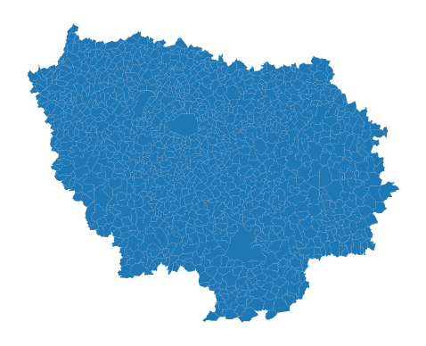
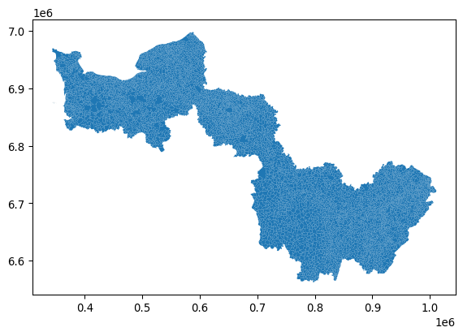
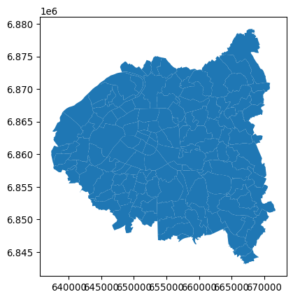

# `cartiflette` 

<div>

[](https://github.com/psf/black)

Code style: black

</div>

`cartiflette` est un projet pour faciliter l’association de sources
géographiques en proposant des récupérations facilitées de coutours de
cartes officiels.

Une documentation interactive est en préfiguration sur la plateforme
observable: https://observablehq.com/@linogaliana/cartiflette-demo

## Installation

A l’heure actuelle, `cartiflette` est structuré sous la forme d’un
`package` :package: `Python` :snake:. Ceci est amené à évoluer pour
faciliter encore plus la récupération de contours grâce à des API.

De nombres évolutions étant encore à venir, n’hésitez donc pas à repasser
fréquemment sur cette page.

``` python
pip install requests py7zr geopandas openpyxl tqdm s3fs PyYAML xlrd
pip install git+https://github.com/inseefrlab/cartogether
```

Pour tester le package, vous pouvez tenter de récupérer le contour des
communes de la région Normandie :

``` python
import cartiflette.s3

normandie = cartiflette.s3.download_vectorfile_url_all(
    crs = 4326,
    values = "11",
    borders="COMMUNE",
    vectorfile_format="topojson",
    filter_by="REGION",
    source="EXPRESS-COG-CARTO-TERRITOIRE",
    year=2022)
ax = normandie.plot()
ax.set_axis_off()
```

    https://minio.lab.sspcloud.fr/projet-cartiflette/diffusion/shapefiles-test1/year=2022/administrative_level=COMMUNE/crs=4326/REGION=11/vectorfile_format=topojson/provider=IGN/source=EXPRESS-COG-CARTO-TERRITOIRE/raw.topojson



ou des régions Ile de France, Normandie et Bourgogne :

``` python
regions = cartiflette.s3.download_vectorfile_url_all(
    crs = 4326,
    values = ["11","27","28"],
    borders="COMMUNE",
    vectorfile_format="topojson",
    filter_by="REGION",
    source="EXPRESS-COG-CARTO-TERRITOIRE",
    year=2022)

ax = regions.plot()
ax.set_axis_off()
```

    https://minio.lab.sspcloud.fr/projet-cartiflette/diffusion/shapefiles-test1/year=2022/administrative_level=COMMUNE/crs=4326/REGION=11/vectorfile_format=topojson/provider=IGN/source=EXPRESS-COG-CARTO-TERRITOIRE/raw.topojson
    https://minio.lab.sspcloud.fr/projet-cartiflette/diffusion/shapefiles-test1/year=2022/administrative_level=COMMUNE/crs=4326/REGION=27/vectorfile_format=topojson/provider=IGN/source=EXPRESS-COG-CARTO-TERRITOIRE/raw.topojson
    https://minio.lab.sspcloud.fr/projet-cartiflette/diffusion/shapefiles-test1/year=2022/administrative_level=COMMUNE/crs=4326/REGION=28/vectorfile_format=topojson/provider=IGN/source=EXPRESS-COG-CARTO-TERRITOIRE/raw.topojson



``` python
regions =  cartiflette.s3.download_vectorfile_url_all(
    crs = 4326,
    values = ["11","27","28"],
    borders="COMMUNE_ARRONDISSEMENT",
    vectorfile_format="topojson",
    filter_by="DEPARTEMENT",
    source="EXPRESS-COG-CARTO-TERRITOIRE",
    year=2022)
ax = regions.plot()
ax.set_axis_off()
```

    https://minio.lab.sspcloud.fr/projet-cartiflette/diffusion/shapefiles-test1/year=2022/administrative_level=COMMUNE_ARRONDISSEMENT/crs=4326/DEPARTEMENT=11/vectorfile_format=topojson/provider=IGN/source=EXPRESS-COG-CARTO-TERRITOIRE/raw.topojson
    https://minio.lab.sspcloud.fr/projet-cartiflette/diffusion/shapefiles-test1/year=2022/administrative_level=COMMUNE_ARRONDISSEMENT/crs=4326/DEPARTEMENT=27/vectorfile_format=topojson/provider=IGN/source=EXPRESS-COG-CARTO-TERRITOIRE/raw.topojson
    https://minio.lab.sspcloud.fr/projet-cartiflette/diffusion/shapefiles-test1/year=2022/administrative_level=COMMUNE_ARRONDISSEMENT/crs=4326/DEPARTEMENT=28/vectorfile_format=topojson/provider=IGN/source=EXPRESS-COG-CARTO-TERRITOIRE/raw.topojson



## Plus de détails

- Pitch du projet ici : https://10pourcent.etalab.studio/projets/insee/
- Ateliers ici :
  https://github.com/etalab-ia/programme10pourcent/wiki/Ateliers-Faciliter-l%E2%80%99association-de-sources-de-donn%C3%A9es-g%C3%A9ographiques-issues-de-divers-producteurs-(INSEE,-IGN,-collectivit%C3%A9s-locales%E2%80%A6)#atelier2
