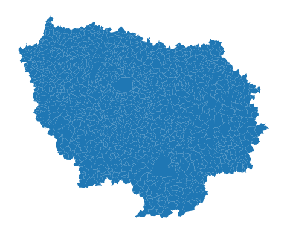
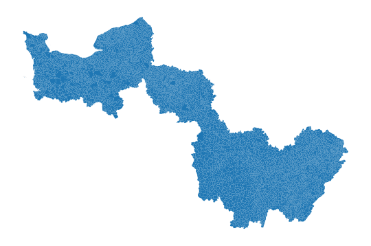
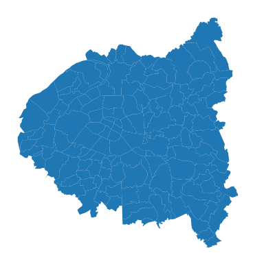

# `cartiflette` 

`cartiflette` est un projet pour faciliter l’association de sources
géographiques en proposant des récupérations facilitées de coutours de
cartes officiels.

## Installation

A l’heure actuelle, `cartiflette` est structuré sous la forme d’un
`package` :package: `Python` :snake:. Ceci est amené à évoluer pour
faciliter encore plus la récupération de contours grâce à des API.

Tout ceci est donc amené à bien évoluer, n’hésitez pas à revenir
fréqumment sur cette page.

``` python
pip install requests py7zr geopandas openpyxl tqdm s3fs PyYAML xlrd
pip install git+https://github.com/inseefrlab/cartogether
```

Pour tester le package, vous pouvez tenter de récupérer le contour des
communes de la région Normandie:

``` python
import cartiflette.s3

normandie = cartiflette.s3.download_vectorfile_url_all(
    values = "11",
    level="COMMUNE",
    vectorfile_format="geojson",
    decoupage="region",
    year=2022)
ax = normandie.plot()
ax.set_axis_off()
```



ou des régions Ile de France, Normandie et Bourgogne

``` python
regions = cartiflette.s3.download_vectorfile_url_all(
    values = ["11","27","28"],
    level="COMMUNE",
    vectorfile_format="GPKG",
    decoupage="region",
    year=2022)
ax = regions.plot()
ax.set_axis_off()
```



``` python
regions = cartiflette.s3.download_vectorfile_url_all(
    values = ["75", "92", "93", "94"],
    level="COMMUNE_ARRONDISSEMENT",
    vectorfile_format="geojson",
    decoupage="departement",
    year=2022)
ax = regions.plot()
ax.set_axis_off()
```



## Plus de détails

- Pitch du projet ici: https://10pourcent.etalab.studio/projets/insee/
- Ateliers ici:
  https://github.com/etalab-ia/programme10pourcent/wiki/Ateliers-Faciliter-l%E2%80%99association-de-sources-de-donn%C3%A9es-g%C3%A9ographiques-issues-de-divers-producteurs-(INSEE,-IGN,-collectivit%C3%A9s-locales%E2%80%A6)#atelier2
