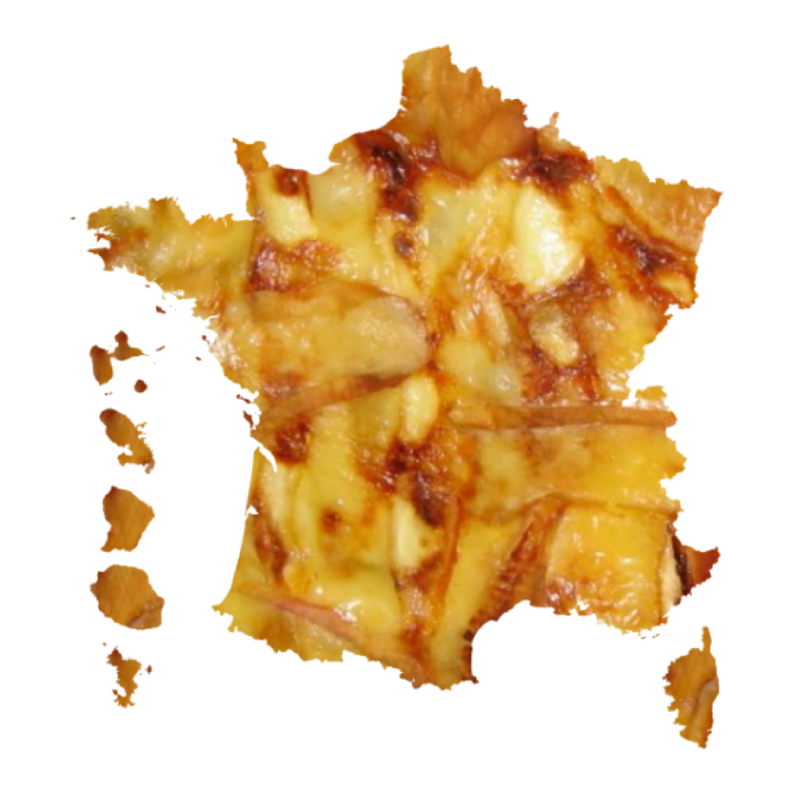

# `cartiflette` [](https://github.com/psf/black)     


`cartiflette` est un projet pour faciliter l’association de sources
géographiques en proposant des récupérations facilitées de coutours de
cartes officiels.

Une documentation interactive est en préfiguration sur la [plateforme observable](https://observablehq.com/@linogaliana/cartiflette-demo).

L'objectif de `cartiflette` est d'offrir des méthodes fiables, 
reproductibles et multi-langages pour récupérer des fonds de carte officiels de l'IGN
enrichis de métadonnées utiles pour la cartographie et la _data science_. 

La récupération des fonds de carte de l'IGN par le biais de `cartiflette` est 
possible par le biais de clients ,
 et
.
Une API est en cours de développement.

De nombres évolutions étant encore à venir, n’hésitez donc pas à repasser
fréquemment sur cette page.

<details>
  <summary>
  Installer la librairie 
  </summary>

``` python
pip install git+https://github.com/inseefrlab/cartogether
```

</details>


## Exemples

Plus d'exemples sont disponibles dans la documentation interactive
sur [`ObservableHQ`](https://observablehq.com/@linogaliana/cartiflette-demo?collection=@linogaliana/cartiflette).

<details>
  <summary>
    Exemple de récupération du fonds de carte des départements avec les DROM rapprochés de la France métropolitaine
  </summary>


</details>

## Contexte

Le projet `cartiflette` est un projet collaboratif lancé par des agents de l'Etat dans le cadre d'un programme interministériel
nommé [Programme 10%](https://www.10pourcent.etalab.gouv.fr/).

__Vous désirez contribuer ?__ Plus d'information sont disponibles dans le fichier [CONTRIBUTING.md](CONTRIBUTING.md)
