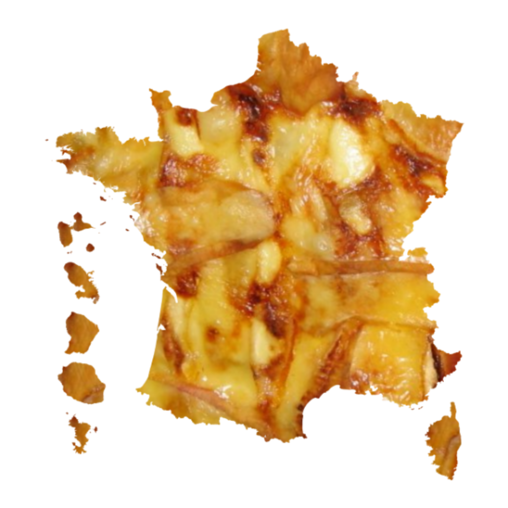
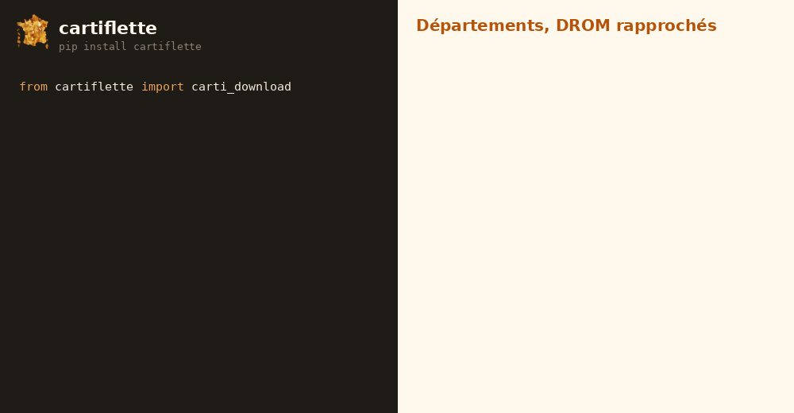
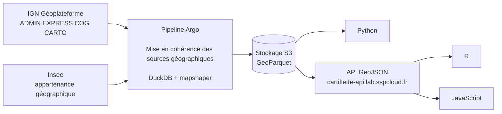

<div align="center">

# cartiflette

**Les fonds de carte officiels français, en moins de 10 lignes de code.**


[](LICENSE)
[](https://pypi.org/project/cartiflette/)
[](https://pepy.tech/projects/cartiflette)
<br />
[](https://www.python.org/)
[](https://duckdb.org/)
[](https://github.com/astral-sh/ruff)
[](https://github.com/astral-sh/uv)
<br />
[](https://github.com/InseeFrLab/cartiflette/actions/workflows/check.yml)
[](https://github.com/InseeFrLab/cartiflette/actions/workflows/lint.yml)
[](https://hub.docker.com/r/inseefrlab/cartiflette)

 Python ·
 R ·
 JavaScript

[Site et exemples](https://inseefrlab.github.io/cartiflette/) ·
[Client Python](python-package/cartiflette) ·
[Documentation du client](https://inseefrlab.github.io/cartiflette/doc/client-python.html) ·
[Documentation technique](https://inseefrlab.github.io/cartiflette/doc/)




<br />



</div>

---

Faire une carte de France, c'est souvent passer plus de temps à chercher le bon
fond de carte qu'à faire la carte. 

`cartiflette` s'en occupe :

- 🗺️ **Des contours officiels enrichis** : ADMIN EXPRESS COG CARTO de l'IGN, au
millésime du Code officiel géographique, enrichi de la table d'appartenance géographique de l'Insee pour avoir plus de métadonnées géographiques officielles.
- 🧩 **Couvre des besoins standards** de *data scientists*, statisticiens ou géomaticiens : récupérer des communes, arrondissements municipaux, départements, régions, zonages d'étude de l'Insee (bassins de vie, zones d'emploi, unités urbaines, aires d'attraction des villes).
- 🏝️ **Les DROM rapprochés de la métropole**, avec un zoom sur l'Île-de-France, prêts pour une carte de France entière.
- 🏷️ **Des métadonnées utiles** : codes et libellés Insee, population, codes des zonages supra-communaux, pour joindre directement vos données.
- ⚡ **Rapide** : le stockage en GeoParquet accélère énormément les récupérations de données (seulement 2 Mo de données pour les communes d'un département, sur 35 Mo pour la France entière...).
- 🔁 **Reproductible** : les fichiers s'appuient sur des données ouvertes, aucune modification manuelle n'est faite, tout est auditable et reproductible, consommable par votre langage de prédilection (Python, R ou JavaScript...).

## Démarrage rapide

```shell
pip install cartiflette
```

```python
from cartiflette import carti_download

departements = carti_download(
    values="France",
    borders="DEPARTEMENT",
    filter_by="FRANCE_ENTIERE_DROM_RAPPROCHES",
    year=2026,
    simplification=50,
)
departements.plot("POPULATION")
```

Le résultat est un `GeoDataFrame` geopandas, prêt pour une jointure avec vos
données (`INSEE_DEP`, `INSEE_REG`, `INSEE_COM`…).

## Ce que vous pouvez récupérer

`borders` choisit le niveau des contours, `filter_by` et `values` la zone couverte :

| `borders` | `filter_by` possibles |
|---|---|
| `COMMUNE`, `COMMUNE_ARRONDISSEMENT` | `DEPARTEMENT`, `REGION`, `BASSIN_VIE`, `ZONE_EMPLOI`, `UNITE_URBAINE`, `AIRE_ATTRACTION_VILLES`, `TERRITOIRE`, `FRANCE_ENTIERE`, `FRANCE_ENTIERE_DROM_RAPPROCHES` |
| `DEPARTEMENT` | `REGION`, `TERRITOIRE`, `FRANCE_ENTIERE`, `FRANCE_ENTIERE_DROM_RAPPROCHES` |
| `REGION`, `BASSIN_VIE`, `ZONE_EMPLOI`, `UNITE_URBAINE`, `AIRE_ATTRACTION_VILLES` | `TERRITOIRE`, `FRANCE_ENTIERE`, `FRANCE_ENTIERE_DROM_RAPPROCHES` |

- `values` : un ou plusieurs codes Insee (`"75"`, `["11", "84"]`), un territoire
  (`"metropole"`, `"guadeloupe"`…) ou `"France"`.
- `COMMUNE_ARRONDISSEMENT` : Paris, Lyon et Marseille découpés en arrondissements.
- `simplification` : `0` (contours complets) ou `50` (50 % des points retirés,
  plus léger pour une carte).
- `year` : millésimes 2022 à 2026, en WGS84 (EPSG:4326).

## Aller plus loin

Toute la lecture passe par [DuckDB](https://duckdb.org/). Avec
`engine="duckdb"`, le résultat reste une relation DuckDB, pour continuer en SQL
sans passer par geopandas :

```python
communes = carti_download(
    values=["11", "84"],
    borders="COMMUNE",
    filter_by="REGION",
    year=2026,
    engine="duckdb",
)
communes.aggregate("INSEE_REG, sum(POPULATION)")
```

Derrière un proxy, déclarer la variable d'environnement `https_proxy` : elle est
transmise à DuckDB. D'autres exemples et cas d'usage sont sur le
[site de cartiflette](https://inseefrlab.github.io/cartiflette/), et
toutes les options dans le [README du client Python](python-package/cartiflette).

## En R et en JavaScript

Les mêmes fonds de carte sont disponibles depuis :

-  (**R**) : `library(cartiflette)` puis `carti_download(...)` ;
-  (**JavaScript / Observable**) : `import {carti_download} from "@linogaliana/cartiflette-js"`.

Des exemples dans chaque langage sont sur le
[site de documentation](https://inseefrlab.github.io/cartiflette/).

## Comment ça marche


```mermaid
flowchart LR
    IGN["IGN Géoplateforme<br/>ADMIN EXPRESS COG CARTO"] --> P
    INSEE["Insee<br/>appartenance géographique"] --> P
    P["Pipeline Argo<br/><br/>Mise en cohérence des sources géographiques<br/><br/>DuckDB + mapshaper"] --> S3[("Stockage S3<br/>GeoParquet")]
    S3 --> PY["Python"]
    S3 --> API["API GeoJSON<br/>cartiflette-api.lab.sspcloud.fr"]
    API --> R["R"]
    API --> JS["JavaScript"]
```

Le détail est dans la [documentation technique](doc/).

## Contexte

`cartiflette` est un projet qui vise à simplifier l'utilisation de données géographiques et la représentation cartographique en s'appuyant sur les données officielles de l'Insee et de l'IGN. 

Le projet a bénéficié, pendant trois saisons, du soutien du
du [Programme 10 %](https://www.10pourcent.etalab.gouv.fr/), porté par
la Direction du Numérique.

**Envie de contribuer ?** Tout est expliqué dans [CONTRIBUTING.md](CONTRIBUTING.md).
