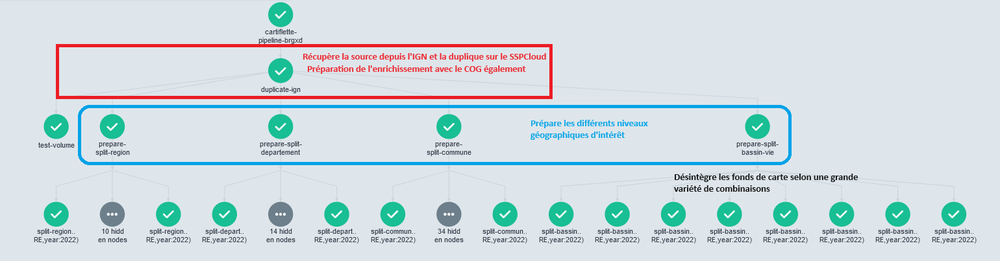

# Notes sur le _pipeline_

Le _pipeline_ utilise la technologie `Argo`
et s'appuie sur l'infrastructure du `SSPCloud`
pour fonctionner.

Pour le lancer, dans un service ayant des droits admin
de Kubernetes:

```shell
argo submit argo-pipeline/pipeline.yaml
```

## Structure du _pipeline_



Une première étape consiste à récupérer la source depuis `MinIO` si le md5 de la source disponible sur le site
de l'IGN a évolué. 

Ensuite, on éclate les données selon de nombreuses dimensions.
Ces déstructurations sont menées de manière parallèle.
Pour mettre en forme le DAG de manière plus lisible, une étape
_passe plat_ a lieu par le biais de `prepare-split-`.


## Remarques


### Volumes et héritages entre les pods

Tout ce qui persiste et est nécessaire entre
les _pods_ est stocké dans un volume monté.
Cela comprend:

- Le code de `cartiflette` dans la branche cible. Ceci n'a
d'intérêt que si la version embarquée dans l'image `Docker`
n'est pas à jour (par exemple avant de _merger_ une PR)[^1]. 
- Les scripts pour lancer les différentes étapes du _pipeline_. Ceux-ci sont dans
le dossier `argo-pipeline/src`. 
- Les données temporaires nécessaires en local. A l'heure actuelle ([PR #81](https://github.com/InseeFrLab/cartiflette/pull/81/files)), `temp/tagc.csv`

[^1]: Il a fallu référencer le repo `Git` 
par https://github.com/inseefrlab/cartogether
et non pas par https://github.com/InseeFrLab/cartiflette.git
sinon il ne le trouvait pas 