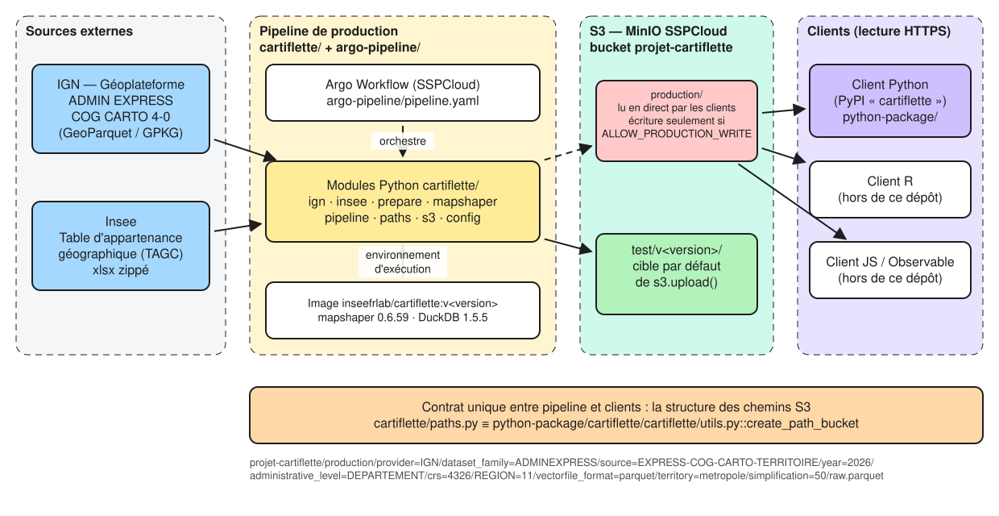
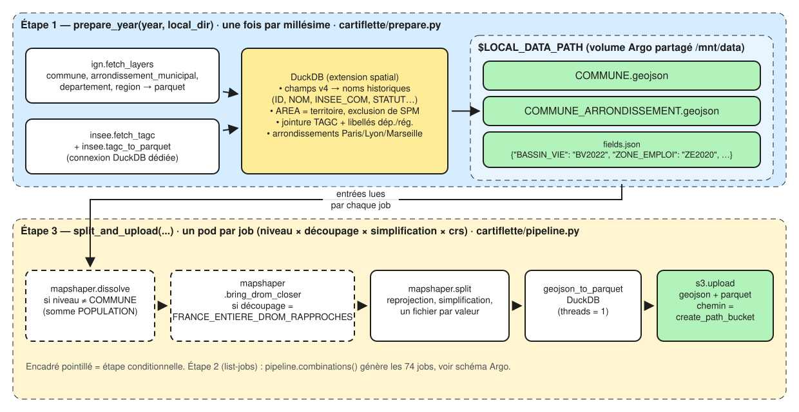

[Source Excalidraw : diagrams/architecture.excalidraw](diagrams/architecture.excalidraw){.small}

## Deux produits dans un même dépôt

| | Pipeline de production | Client Python |
|---|---|---|
| Dossier | `cartiflette/` + `argo-pipeline/` | `python-package/cartiflette/` |
| Nom de distribution | `cartiflette-pipeline` (non publié) | `cartiflette` sur PyPI |
| Rôle | fabriquer les fonds de carte et les écrire sur S3 | lire ces fichiers en HTTPS et renvoyer un `GeoDataFrame` |
| Dépendances clés | DuckDB 1.5.5, mapshaper 0.6.59 (Node), s3fs, py7zr | DuckDB (≥ 1.5), geopandas, pyarrow |
| `pyproject.toml` / `uv.lock` | à la racine | dans `python-package/cartiflette/` |
| Tests | `tests/` | `python-package/cartiflette/tests/` |
| Où ça tourne | pods Argo sur le SSPCloud (image Docker) | poste de l'utilisateur |

Les deux produits ne s'importent pas l'un l'autre. Les clients R et JS
(Observable) vivent dans d'autres dépôts mais lisent les mêmes fichiers.

## Le contrat : la structure des chemins S3

Le seul lien entre le pipeline et tous les clients est l'emplacement des
fichiers. Il est construit par deux fonctions qui doivent rester identiques :

- `cartiflette/paths.py::create_path_bucket` (pipeline) ;
- `python-package/cartiflette/cartiflette/utils.py::create_path_bucket` (client),

et de même `create_path_consolidated` pour le GeoParquet.

```text
{bucket}/{path_within_bucket}
  /provider=IGN
  /dataset_family=ADMINEXPRESS
  /source=EXPRESS-COG-CARTO-TERRITOIRE
  /year={année}
  /administrative_level={niveau des polygones}      ex. DEPARTEMENT
  /crs={EPSG}                                       4326
  /{niveau de découpage}={valeur}                   ex. REGION=11
  /vectorfile_format=geojson
  /territory=metropole
  /simplification={0|50}
  /raw.geojson
```

Le **GeoParquet** a une arborescence différente, construite par `create_path_consolidated` :
un seul fichier par niveau, que le client filtre à la lecture.

```text
{bucket}/{path_within_bucket}
  /provider=IGN
  /dataset_family=ADMINEXPRESS
  /source=EXPRESS-COG-CARTO-TERRITOIRE
  /year={année}
  /administrative_level={niveau des polygones}      ex. COMMUNE
  /crs={EPSG}                                       4326
  /layout={FRANCE_ENTIERE|FRANCE_ENTIERE_DROM_RAPPROCHES}
  /vectorfile_format=parquet
  /simplification={0|50}
  /raw.parquet
```

`layout=FRANCE_ENTIERE_DROM_RAPPROCHES` est à part parce que ses géométries
diffèrent (DROM déplacés, zoom sur l'Île-de-France). Dans chaque fichier :

- les lignes sont triées (`pipeline.sort_levels`) en groupes de 2 048 lignes, pour que
  chaque région, département ou zonage tienne dans un ou deux groupes :
  communes par région, département, bassin de vie puis commune ; départements par région
  puis département ; zonages par territoire puis code ;
- une colonne `bbox` est déclarée comme _covering_ GeoParquet 1.1, pour filtrer par emprise ;
- la métadonnée `cartiflette:filter_columns` associe chaque `filter_by` utilisable à
  sa colonne (ex. `BASSIN_VIE` → `BV2022`). Elle fait partie du contrat avec les clients.

Certaines valeurs sont figées **uniquement pour que les clients continuent de
fonctionner** (voir `cartiflette/config.py`) :

- `source=EXPRESS-COG-CARTO-TERRITOIRE`, alors que la source réelle est ADMIN EXPRESS COG CARTO « France entière » ;
- `territory=metropole` pour tous les fichiers, DROM compris ;
- `filename=raw`.

Les deux suites de tests fixent la même chaîne attendue
(`tests/test_paths_and_s3.py` et `python-package/cartiflette/tests/test_client.py`).
Si l'une change, les clients ne trouvent plus les fichiers.

Côté client, deux ajustements se font **sans toucher au contrat** :
`value_candidates` essaie `REGION=01` puis `REGION=1` (codes non complétés
avant 2025) et `standardize_format` accepte `geoparquet` comme alias de `parquet`.

## Le stockage S3

MinIO du SSPCloud (`https://minio.lab.sspcloud.fr`), bucket `projet-cartiflette` :

| Préfixe | Qui écrit | Qui lit |
|---|---|---|
| `production/` | le pipeline, **uniquement** avec `CARTIFLETTE_ALLOW_PRODUCTION_WRITE=i-know-what-i-am-doing` | tous les clients, en direct (HTTPS public) |
| `test/v<version>/` | le pipeline, par défaut | vous, pour vérifier |
| `test/` (racine) | personne : contient d'anciens essais, ne pas écrire à sa racine | — |

Les millésimes publiés avant 2025 (éditions ADMIN EXPRESS 3-x) restent en
production mais ne sont **pas** régénérables avec le code actuel.

## Le pipeline de production, module par module



[Source Excalidraw : diagrams/flux-donnees.excalidraw](diagrams/flux-donnees.excalidraw){.small}

::: {.callout-tip}
Le code source de ce projet privilégie la programmation fonctionnelle plutôt que la programmation orientée object. 

Cela permet de rendre le  développement du projet plus simple mais reste robuste en cloisonnant les fonctions à un objectif unique. 

:::

| Module | Rôle | Fonctions principales |
|---|---|---|
| `config.py` | emplacements de lecture et d'écriture, libellés historiques, dispositions (`LAYOUTS`) et taille des groupes de lignes du GeoParquet | constantes `WRITE_BUCKET`, `WRITE_PATH`, `ALLOW_PRODUCTION_WRITE`, `LAYOUTS`, `ROW_GROUP_SIZE` |
| `http.py` | session HTTP avec relances (429, 5xx), téléchargement vérifié par `Content-Length` | `get_session`, `download_file` |
| `ign.py` | lecture du catalogue Atom de la Géoplateforme, choix de l'édition, téléchargement des couches en GeoParquet (ou GPKG converti) | `list_editions`, `select_edition`, `list_files`, `fetch_layers`, `gpkg_to_parquet` |
| `insee.py` | téléchargement de la TAGC et conversion xlsx → parquet | `fetch_tagc`, `tagc_to_parquet` |
| `prepare.py` | étape 1 : requêtes DuckDB qui produisent les entrées communes à tous les jobs | `prepare_year`, `communes_query`, `enrich_query`, `zoning_fields` |
| `mapshaper.py` | appels à mapshaper (liste d'arguments, jamais `shell=True`) | `dissolve`, `bring_drom_closer`, `split` |
| `pipeline.py` | étapes 2 et 3 : listes des jobs, traitement d'un job GeoJSON ou GeoParquet, envoi | `combinations`, `process`, `split_and_upload`, `consolidated_combinations`, `process_consolidated`, `to_consolidated_parquet`, `consolidate_and_upload` |
| `paths.py` | contrat de chemins (voir plus haut) | `create_path_bucket` |
| `s3.py` | seul point d'écriture S3, avec le garde-fou production | `get_fs`, `check_write_target`, `upload` |

`argo-pipeline/src/` contient trois petits scripts en ligne de commande, un par
étape Argo, qui ne font qu'appeler ces fonctions : `prepare.py`,
`crossproduct.py`, `split.py`.

### Étape 1 — `prepare_year`

- **Source IGN** : ADMIN EXPRESS COG CARTO édition 4-0, « France entière » (zone `FRA`),
  WGS84. Catalogue Atom : `https://data.geopf.fr/chunk/telechargement/resource/ADMIN-EXPRESS-COG-CARTO`.
  GeoParquet à partir de 2026, GPKG (archive `.7z`) seulement pour 2025.
  `select_edition` préfère le GeoParquet et, à format égal, la date la plus récente.
- **Limite de débit** : la Géoplateforme accepte 1 requête par seconde. `http.get_session`
  relance automatiquement sur les erreurs 429.
- **Noms de champs** : l'édition 4-0 a renommé tous les champs (`code_insee`, `population`…).
  `communes_query` les ramène aux noms historiques (`ID`, `NOM`, `INSEE_COM`, `STATUT`,
  `POPULATION`) et ajoute `AREA` (nom du territoire), pour que les attributs publiés ne changent pas.
- **Territoires** : métropole et les 5 DROM. Saint-Pierre-et-Miquelon
  (`code_insee_du_departement = 'NR'`) est exclu.
- **TAGC Insee** : `table-appartenance-geo-communes-{year}.zip`, en-tête en ligne 6.
  Elle apporte `INSEE_DEP`, `INSEE_REG`, `EPCI` et les zonages d'études (`ZE2020`, `UU2020`,
  `AAV2020`, `BV2022`…). Le millésime de ces zonages change dans le nom du champ
  (`BV2012` est devenu `BV2022`). `zoning_fields` le détecte donc à l'exécution et l'écrit
  dans `fields.json`, sans rien coder en dur.
- **Sorties** : `COMMUNE.geojson`, `COMMUNE_ARRONDISSEMENT.geojson` (Paris, Lyon et
  Marseille remplacées par leurs arrondissements municipaux, `INSEE_COG` = code de
  l'arrondissement) et `fields.json`.

### Étape 2 — `combinations`

Produit du dictionnaire `SPLITS` (niveau des polygones → niveaux de découpage
autorisés), de `SIMPLIFICATIONS = [0, 50]` et de `CRS = [4326]`, soit
**74 jobs** : 37 couples × 2 simplifications × 1 projection.

### Étape 3 — `split_and_upload` (un job)

1. `check_write_target` : échoue **avant tout traitement** si la cible est la production non autorisée ;
2. `process` : repart de `COMMUNE.geojson` (ou `COMMUNE_ARRONDISSEMENT.geojson`), puis :
   - `mapshaper.dissolve` si le niveau n'est pas la commune (somme des populations) ;
   - `mapshaper.bring_drom_closer` si le découpage est `FRANCE_ENTIERE_DROM_RAPPROCHES`
     (DROM déplacés et agrandis près de la métropole, zoom sur l'Île-de-France) ;
   - `mapshaper.split` : reprojection, simplification, un GeoJSON par valeur du champ de découpage ;
3. `upload` de chaque GeoJSON, au chemin donné par `create_path_bucket`.

### Étape 3 bis — `consolidate_and_upload` (un job GeoParquet)

`consolidated_combinations` liste **32 jobs** : 8 niveaux × 2 dispositions (`layout`) × 2 simplifications.
Pour chacun :

1. `check_write_target`, comme pour le GeoJSON ;
2. `process_consolidated` : même préparation des polygones, mais `dissolve` garde les
   champs de **tous** les niveaux de filtre possibles (`filter_levels`), puis
   `mapshaper.finalize` reprojette et simplifie en un seul GeoJSON ;
3. `to_consolidated_parquet` : conversion par DuckDB (tri, groupes de lignes, `bbox`,
   métadonnées `geo` en version 1.1.0 et `cartiflette:filter_columns`) ;
4. `upload` au chemin donné par `create_path_consolidated`.

La simplification est calculée sur tout le territoire du niveau, pas fichier par
fichier : le résultat diffère légèrement des GeoJSON découpés, ce qui est accepté.

Les champs qui portent le code de chaque niveau sont dans
`mapshaper.LEVEL_FIELDS`, complétés par `fields.json` pour les zonages.

## Pièges DuckDB 1.5.5 {#pieges-duckdb}

Ces contournements sont déjà en place. Ils ne doivent pas être « simplifiés » :

- `ST_Read` (GDAL) avec plusieurs threads corrompt la mémoire de façon aléatoire
  (segfault, _Unsupported geometry type in WKB_). Toujours l'appeler avec
  `SET threads = 1`, dans sa propre connexion (`ign.gpkg_to_parquet`,
  `pipeline.to_consolidated_parquet`).
- Pour écrire un GeoParquet 1.1 (avec _covering_), `to_consolidated_parquet` réécrit la
  métadonnée `geo` avec `GEOPARQUET_VERSION NONE`. Garder le CRS en PROJJSON : geopandas
  ignore une simple chaîne `OGC:CRS84`.
- Ne pas charger l'extension `excel` dans une connexion qui fait du spatial. La TAGC
  est convertie dans une connexion séparée (`insee.tagc_to_parquet`).
- Exécuter `LOAD spatial` **avant** `SET geometry_always_xy = true`, pour que les
  coordonnées restent en (lon, lat).
- `SET enable_progress_bar = false`, sinon les logs Argo sont illisibles.

## Infrastructure autour du code

| Élément | Fichier | Rôle |
|---|---|---|
| Image Docker | `Dockerfile`, `docker/install-mapshaper.sh` | base Onyxia Python 3.10, mapshaper 0.6.59, dépendances du pipeline, extensions DuckDB préinstallées |
| Workflow Argo | `argo-pipeline/pipeline.yaml` | DAG `prepare → list-jobs → split` (voir [02](02-lancer-le-pipeline.qmd)) |
| CI tests | `.github/workflows/check.yml` | `pytest` pipeline (avec mapshaper) et client, à chaque push |
| CI lint | `.github/workflows/lint.yml` | flake8 et pylint sur `cartiflette/` |
| CI image | `.github/workflows/docker.yml` | construit `inseefrlab/cartiflette:v<version>` sur `main` et sur les tags `v*` |
| CI PyPI | `.github/workflows/pypi.yml` | publie le client sur un tag `v*` |
