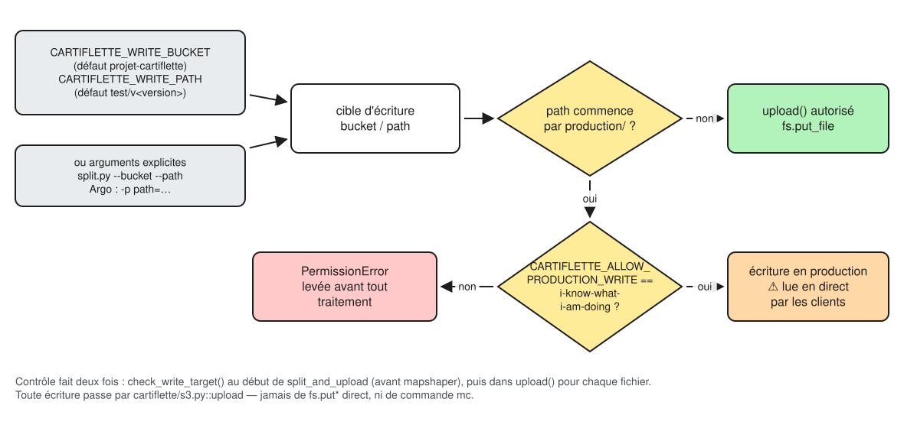
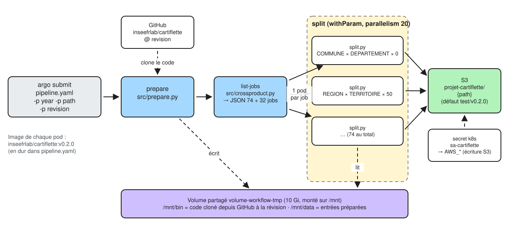
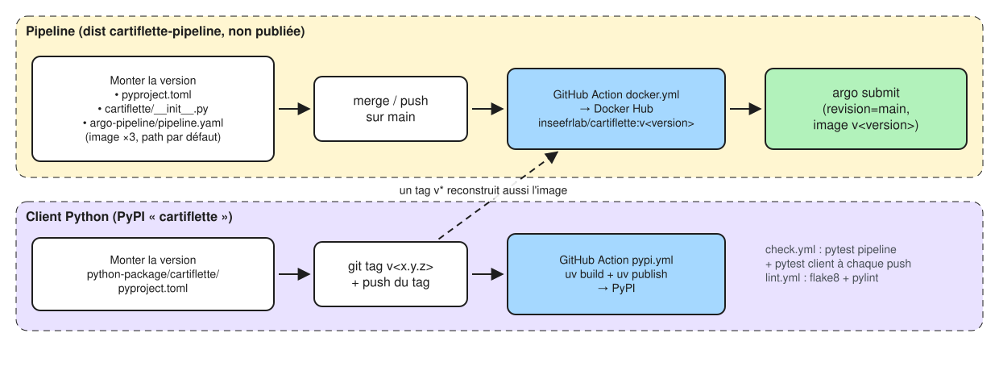

<br>

Il y a trois façons de lancer le pipeline, de la moins risquée à la plus risquée :

| Mode | Écrit sur S3 ? | Usage |
|---|---|---|
| [A. Local, sans S3](#mode-local) | non | mettre au point, vérifier une brique ou un millésime |
| [B. Argo vers `test/v<version>`](#mode-argo-test) | oui, en test | produire un jeu complet et le relire avec les clients |
| [C. Argo vers `production`](#mode-production) | oui, **en production** | publier, après validation de B |

::: {.callout-warning}
Tout lancement qui écrit sur S3, **même en test**, se décide explicitement.
Le garde-fou du code est décrit ci-dessous.
:::



[Source Excalidraw : diagrams/ecriture-s3.excalidraw](diagrams/ecriture-s3.excalidraw){.small}

## Prérequis {#prerequis}

```python
uv sync

# mapshaper 0.6.59 (Node), si absent du PATH : installation locale hors du dépôt
mkdir -p ~/mapshaper && (cd ~/mapshaper && npm install mapshaper@0.6.59)
export PATH="$HOME/mapshaper/node_modules/.bin:$PATH"
mapshaper -v   # doit afficher 0.6.59
```

Pour écrire sur S3 (modes B et C), `s3fs` utilise les variables `AWS_*` de
l'environnement. Dans un service Onyxia du SSPCloud, elles sont déjà définies.
Sur Argo, elles viennent du secret Kubernetes `sa-cartiflette`.

## A. En local, sans écrire sur S3 {#mode-local}

C'est le mode à utiliser d'abord. Il lit les sources publiques de l'IGN et de
l'Insee et n'écrit que sur le disque.

```bash
# hors du dépôt
DATA=/tmp/cartiflette/2026        
YEAR=2026

# Étape 1 : télécharge et prépare (quelques minutes, plusieurs centaines de Mo)
uv run python argo-pipeline/src/prepare.py --year $YEAR --localpath $DATA
ls $DATA   # COMMUNE.geojson  COMMUNE_ARRONDISSEMENT.geojson  fields.json  raw/

# Étape 2 : liste des jobs (tous, ou limités à un niveau de polygones)
uv run python argo-pipeline/src/crossproduct.py --restrictfield REGION
```

Pour l'étape 3 sans envoi sur S3, appeler directement
`pipeline.process_consolidated`, la partie de `consolidate_and_upload` qui ne fait
que les traitements :

```bash
uv run python -c "
from cartiflette.pipeline import process_consolidated
print(process_consolidated('$DATA', '/tmp/cartiflette/work', 'REGION', 'FRANCE_ENTIERE_DROM_RAPPROCHES', 50, 4326))
"
```

Le dossier de travail garde aussi le GeoJSON intermédiaire
(`/tmp/cartiflette/work/final.geojson`), à ouvrir dans QGIS ou sur
<https://mapshaper.org> pour vérifier le rendu. Le chapitre [03](03-verifier-et-faire-evoluer.qmd) détaille
les contrôles à faire.

### Variante : local avec envoi vers l'espace de test

`argo-pipeline/src/consolidate.py` exécute un job complet, envoi compris. Sans
`--bucket` ni `--path`, il écrit dans `projet-cartiflette/test/v<version>`
(voir `cartiflette/config.py`). Il crée un dossier de travail `work/` dans le
répertoire courant : le lancer depuis un dossier temporaire.

```bash
# ⚠ écrit sur S3 (espace de test)
REPO=$(pwd)
cd /tmp/cartiflette && uv run --project $REPO python $REPO/argo-pipeline/src/consolidate.py \
  --year 2026 --inputs $DATA \
  --level_polygons REGION --layout FRANCE_ENTIERE --simplification 50 --crs 4326 \
  --path test/v0.4.0
```

## B. Sur Argo, vers l'espace de test {#mode-argo-test}



[Source Excalidraw : diagrams/argo-dag.excalidraw](diagrams/argo-dag.excalidraw){.small}

### Ce que fait le workflow

`argo-pipeline/pipeline.yaml` définit un DAG dans le namespace
`projet-cartiflette` (le schéma ci-dessus montre un millésime) :

0. `check-target` clone le dépôt GitHub à la révision `revision` dans `/mnt/bin`
   (volume partagé `volume-workflow-tmp`, 20 Gi) et vérifie la cible d'écriture :
   `path=production` sans `allow_production_write=true` échoue ici, avant tout
   téléchargement ;

puis, pour chaque millésime de `years`, deux années à la fois (sous-DAG `year`) :

1. `prepare` écrit les entrées dans `/mnt/data/<année>` (environ 1 Gi par année) ;
2. `list-jobs` imprime la liste JSON des 48 jobs GeoParquet ;
3. `consolidate` crée un pod par job
   (`withParam`), au plus 10 pods à la fois pour l'ensemble du workflow. Chaque pod lit
   `/mnt/data/<année>` et écrit sur S3 sous `{path}`.

`prepare` et `consolidate` sont relancés jusqu'à 2 fois (attente de 1 puis
2 minutes) : un job relancé réécrit les mêmes chemins.

Paramètres du workflow :

| Paramètre | Défaut | Sens |
|---|---|---|
| `years` | `["2025"]` | millésimes ADMIN EXPRESS et TAGC à produire, liste JSON (2021 et après) |
| `path` | `test/v0.4.0` | préfixe d'écriture dans le bucket (transmis en `CARTIFLETTE_WRITE_PATH`) |
| `allow_production_write` | `false` | transmis en `CARTIFLETTE_ALLOW_PRODUCTION_WRITE` ; voir [C](#mode-production) |
| `revision` | `main` | branche, tag ou commit dont le **code Python** est utilisé |
| `image` | `inseefrlab/cartiflette:v0.4.0` | image Docker : mapshaper, DuckDB et dépendances Python |

`revision` ne change que le code de `cartiflette/` et `argo-pipeline/src/` ; les
dépendances viennent de `image`.

### Lancer

::: {.callout-important}
## Quelles années sont produites ?

**Uniquement celles de `years`.** Sans `-p years=...`, le workflow ne produit
que **2025** (valeur par défaut du YAML). Toujours passer la liste explicitement,
au format JSON :

- jeu complet : `-p years='["2022", "2023", "2024", "2025", "2026"]'` ;
- un seul millésime : `-p years='["2026"]'`.

Les années de la liste tournent deux par deux, au plus 10 pods à la fois pour
l'ensemble. Millésimes pris en charge : 2021 et après (éditions IGN 3-x à partir
de 2021, 4-0 à partir de 2025).
:::

Il faut un service du SSPCloud avec les droits Kubernetes du projet
`projet-cartiflette` (rôle admin) et la CLI `argo`, à la version du serveur Argo
du cluster. `argo-pipeline/install-argo.sh` l'installe : il lit la version du
contrôleur Argo dans le namespace, puis télécharge la CLI correspondante dans
`~/.local/bin`.

```bash
argo-pipeline/install-argo.sh                # namespace projet-cartiflette
ARGO_VERSION=v3.6.4 argo-pipeline/install-argo.sh   # version imposée
export PATH="$HOME/.local/bin:$PATH"
```

```bash
# ⚠ écrit sur S3 (espace de test). Une branche de travail, un préfixe neuf.
argo submit argo-pipeline/pipeline.yaml -n projet-cartiflette \
  -p years='["2022", "2023", "2024", "2025", "2026"]' \
  -p path=test/v0.4.0 \
  -p revision=ma-branche \
  --watch
```

Suivi et reprise :

```bash
argo list                          # workflows du namespace
argo get @latest                   # état de chaque étape
argo logs @latest -f               # logs de tous les pods
argo logs @latest --grep ERROR     # filtrer
argo retry @latest                 # relancer les étapes en échec
argo delete @latest                # nettoyer
```

### Charge et nettoyage

Le workflow limite lui-même son emprise sur le cluster (`spec` de
`pipeline.yaml`, vérifié par `tests/test_argo.py`) :

| Réglage | Valeur | Effet |
|---|---|---|
| `parallelism` | 10 | pods simultanés, toutes années confondues |
| `parallelism` du template `main` | 2 | années préparées et traitées en même temps (téléchargements, disque) |
| `activeDeadlineSeconds` | 12 h | arrêt du workflow s'il reste bloqué |
| `podGC: OnPodSuccess` | — | pod supprimé dès qu'une étape réussit ; les pods en échec restent pour `argo logs` |
| `ttlStrategy` | 1 jour (succès), 7 jours (échec) | suppression du workflow et de ses pods restants |
| `volumeClaimGC: OnWorkflowSuccess` | — | volume de 20 Gi supprimé en cas de succès ; conservé après un échec pour `argo retry`, puis supprimé avec le workflow |
| `templateDefaults.archiveLocation` | `argo-logs/` | logs de chaque étape archivés sur S3, conservés après la suppression des pods |

**Logs archivés.** À la fin de chaque étape, Argo copie ses logs dans
`projet-cartiflette/argo-logs/<workflow>/<pod>/`, avec la clé du secret
`sa-cartiflette`. Ces écritures sont faites par Argo et non par `s3.upload` :
le préfixe est fixe, hors de `test/` et de `production/`. L'interface web
d'Argo affiche ces archives ; `argo logs` en ligne de commande ne lit que les
pods encore présents. Pour les lire directement :

```bash
mc ls s3/projet-cartiflette/argo-logs/cartiflette-pipeline-xxxxx/
mc cat s3/projet-cartiflette/argo-logs/cartiflette-pipeline-xxxxx/<pod>/main.log
```

`argo-logs/` n'est pas purgé automatiquement : supprimer de temps en temps les
dossiers des anciens workflows (`mc rm --recursive --force --older-than 30d
s3/projet-cartiflette/argo-logs/`).

Pour aller plus vite ou plus doucement, modifier `parallelism` dans le YAML
(ce n'est pas un paramètre `-p`).

Nettoyer à la main les workflows terminés ou les anciens pods en échec :

```bash
argo list -n projet-cartiflette --completed           # workflows terminés
argo delete -n projet-cartiflette --completed --older 1d
kubectl get pods -n projet-cartiflette --field-selector=status.phase=Failed
```

### Tester une branche sur Argo : ce qui est pris en compte

| Modification sur la branche | Prise en compte avec `-p revision=ma-branche` ? |
|---|---|
| code Python de `cartiflette/` ou `argo-pipeline/src/` | oui |
| `argo-pipeline/pipeline.yaml` | oui, puisque c'est le fichier local qui est soumis |
| dépendances (`pyproject.toml`, `uv.lock`), `Dockerfile`, version de mapshaper | **non** : l'image n'est publiée que depuis `main` et les tags `v*` (sur une PR, elle est seulement construite, pour vérification) |

Pour tester une nouvelle dépendance sur Argo, il faut une image. Soit on
fusionne dans `main` (ce qui écrase l'image de la version en cours), soit on
monte la version (voir [plus bas](#versions)).

## C. En production {#mode-production}

À faire seulement après un passage complet en B, relu avec les clients (voir
[03](03-verifier-et-faire-evoluer.qmd#relire-test)).

1. **Décider explicitement** la publication, et l'annoncer à l'équipe : les
   fichiers d'un millésime déjà publié sont **écrasés**, et les clients les lisent en direct.
2. Prérequis : la branche est fusionnée dans `main` et l'image
   `inseefrlab/cartiflette:v<version>` est construite (workflow GitHub `docker.yml`,
   sur `main` ou un tag `v*`).
3. Soumettre depuis `main` (ou un tag), jamais depuis une branche non fusionnée,
   en autorisant l'écriture **en ligne de commande**. Le YAML versionné garde
   `allow_production_write: "false"` (vérifié par `tests/test_argo.py`).

```bash
# ⚠⚠ écrit dans projet-cartiflette/production, lu par tous les clients
argo submit argo-pipeline/pipeline.yaml -n projet-cartiflette \
  -p years='["2026"]' \
  -p path=production \
  -p allow_production_write=true \
  -p revision=main \
  --watch
```

Sans `allow_production_write=true`, l'étape `check-target` échoue avec
`PermissionError` et rien n'est téléchargé ni écrit.

4. Relire quelques fichiers avec le client publié (`carti_download(...)` sans
   `path_within_bucket`), et lancer les tests d'intégration sur la production :
   `CARTIFLETTE_TEST_PATH=production CARTIFLETTE_TEST_YEARS=... uv run pytest -m integration`
   dans `python-package/cartiflette`.

### État de la production

Le _pipeline_ ne publie que du GeoParquet ; le GeoJSON est servi par l'API
([04](04-api-geojson.qmd)).

| Millésime | En production | Lisible par |
|---|---|---|
| 2023 à 2026 | GeoParquet (_pipeline_ 0.3.0, publiés le 4 octobre 2026) | client Python ≥ 0.2.0 (0.2.1 sur PyPI), API ; pas les clients R et JS non passés sur l'API, ni le client Python < 0.2.0 |
| 2022 | GeoJSON de l'ancien _pipeline_ | tous les clients, et l'API (redirection) |

Ordre suivi pour cette publication : publication du client 0.2.1 sur PyPI (seul
capable de lire le GeoParquet consolidé), puis _workflow_ de production pour
`["2023", "2024", "2025", "2026"]`, puis tests d'intégration sur la production.

Reste une décision à part :

- **2022** : republier ajoute un GeoParquet à côté des GeoJSON de l'ancien _pipeline_, qui
  **ne sont pas écrasés** puisque le _pipeline_ n'écrit plus de GeoJSON. Le client
  Python ≥ 0.2.0 lira alors ce GeoParquet (contrôle par requête HEAD), avec les
  changements du nouveau _pipeline_ : `BV2012` devient `BV2022`, aires d'attraction
  et unités urbaines découpées par territoire (DROM correctement placés). L'API, elle,
  continue de rediriger vers les anciens GeoJSON 2022 jusqu'à son redémarrage
  (`kubectl rollout restart deployment/cartiflette-api`), puis sert le GeoParquet.
  C'est une décision à part entière : les utilisateurs de 2022 verront ces
  changements.

::: {.callout-caution}
Ne jamais « copier » un résultat de test vers la production avec `mc` ou
`fs.put*` : toute écriture passe par `s3.upload`.
:::

## Versions, images et publication {#versions}



[Source Excalidraw : diagrams/versions-release.excalidraw](diagrams/versions-release.excalidraw){.small}

La version du pipeline apparaît à **plusieurs endroits** qu'il faut modifier ensemble :

| Fichier | Valeur |
|---|---|
| `pyproject.toml` | `version = "0.4.0"` : sert à taguer l'image Docker |
| `cartiflette/__init__.py` | `__version__ = "0.4.0"` : sert au préfixe de test par défaut `test/v0.4.0` |
| `argo-pipeline/pipeline.yaml` | paramètres `image` (`inseefrlab/cartiflette:v0.4.0`) et `path` (`test/v0.4.0`) ; `tests/test_argo.py` vérifie qu'ils suivent la version |
| `argo-pipeline/README.md` | exemple de commande |

Le client Python a **sa propre version** (`python-package/cartiflette/pyproject.toml`).
Pousser un tag `v*` publie le client sur PyPI et reconstruit aussi l'image
Docker, avec la version lue dans le `pyproject.toml` racine. Avant de publier,
`pypi.yml` vérifie que le tag vaut `v` suivi de la version du client, puis lance
ses tests : une incohérence ou un test en échec arrête la publication.

Taguer **après** la mise en production des nouveaux millésimes : sans `year`, le
client lit l'année en cours.

::: {.callout-warning}
Si on pousse sur `main` sans monter la version, l'image existante
`inseefrlab/cartiflette:v<version>` est **écrasée**.
:::

## Dépannage

| Symptôme | Cause probable | Où regarder |
|---|---|---|
| `429 Too Many Requests` en boucle, `prepare` très lent | limite de 1 requête/s de la Géoplateforme | `http.get_session` (relances, `Retry-After`) |
| `Incomplete download of …` | téléchargement interrompu | relancer ; `http.download_file` |
| `No France entière WGS84 edition of … for YYYY` | l'IGN n'a pas encore publié l'édition, ou son nom a changé | `ign.select_edition`, catalogue Atom |
| erreur 404 sur la TAGC | fichier Insee pas encore publié, ou identifiant de page (`7671844`) changé | `insee.TAGC_URL` |
| `No BVYYYY field for BASSIN_VIE` | colonnes de la TAGC renommées | `prepare.ZONING_PREFIXES` |
| segfault, _Unsupported geometry type in WKB_ | `ST_Read` exécuté avec plusieurs threads | [pièges DuckDB](01-architecture.qmd#pieges-duckdb) |
| `PermissionError: Refusing to write to projet-cartiflette/production…` | garde-fou normal | voulu : utiliser un préfixe de test |
| `KeyError` dans `bring_drom_closer` | nouveau niveau sans entrée dans `IDF_ZOOM` | [03, nouveau niveau](03-verifier-et-faire-evoluer.qmd#nouveau-niveau) |
| pods `consolidate` bloqués en `ContainerCreating` | le volume est en `ReadWriteOnce` et les pods ont été placés sur des nœuds différents | `volumeClaimTemplates` dans `pipeline.yaml` |
| `mapshaper: command not found` en local | mapshaper absent du PATH | [prérequis](#prerequis) |
