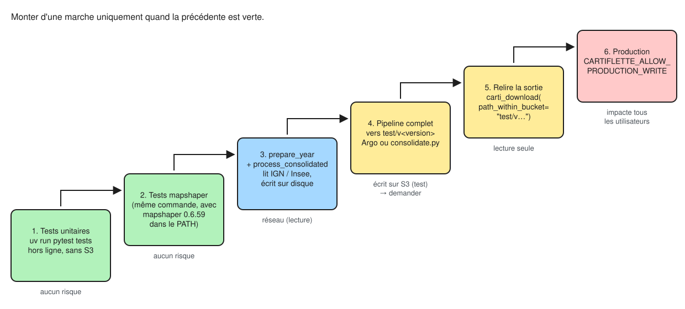

[Source Excalidraw : diagrams/niveaux-verification.excalidraw](diagrams/niveaux-verification.excalidraw){.small}

On monte les marches dans l'ordre. Les marches 1 à 3 n'écrivent rien sur S3 et
suffisent à valider la plupart des changements. La marche 4 écrit dans l'espace
de test : elle se décide explicitement. La marche 6 est la publication.

## 1–2. Tests automatiques

```shell
# Pipeline : hors ligne, jamais d'écriture S3.
# Les tests mapshaper sont ignorés (« skipped ») si mapshaper n'est pas dans le PATH.
uv run pytest tests

# Client : les tests marqués `network` lisent un fichier publié en production (lecture seule)
cd python-package/cartiflette
uv run pytest tests                  # tout
uv run pytest tests -m "not network" # hors ligne

# Qualité du code (à la racine)
uvx ruff check .
uvx vulture cartiflette argo-pipeline/src --min-confidence 80
```

La CI (`check.yml`) installe mapshaper 0.6.59 et lance les deux suites à chaque
push. Un `skipped` en local n'est donc pas un `passed` : installer mapshaper
(voir [02, prérequis](02-lancer-le-pipeline.qmd#prerequis)) avant de conclure.

### Ce que couvrent les tests

| Brique | Fichier de test | Ce qui est vérifié | Besoin |
|---|---|---|---|
| `ign` | `tests/test_ign.py` | analyse des noms d'édition, préférence GeoParquet > GPKG, année absente, pagination Atom (réponses HTTP simulées) | — |
| `prepare` | `tests/test_prepare.py` | requêtes DuckDB sur de petites tables qui imitent l'IGN 4-0 et la TAGC : renommage des champs, exclusion de SPM, arrondissements PLM, jointure TAGC, écriture GeoJSON, détection des zonages | — |
| `pipeline` | `tests/test_pipeline.py` | nombre de jobs (74), refus de la production **avant** traitement, `process` sur 3 communes synthétiques, conversion parquet (`geometry`, `SOURCE`) | mapshaper pour `test_process` |
| `paths`, `s3` | `tests/test_paths_and_s3.py` | chaîne de chemin exacte (contrat), cible par défaut ≠ production, refus de la production, `upload` sans toucher S3 (système de fichiers simulé) | — |
| client | `python-package/.../tests/test_client.py` | même chaîne de chemin, formats, concaténation, repli `REGION=01 → 1`, lecture d'un fichier de production | réseau pour `network` |

Ce que les tests **ne couvrent pas** : le vrai schéma des sources IGN et Insee
de l'année, `bring_drom_closer` (positions des DROM), le volume réel des
données et le workflow Argo. Ces points se vérifient à la marche 3.

## 3. Vérifier une brique à la main, en local

Toutes les commandes ci-dessous lisent les sources publiques et écrivent
uniquement sur le disque. On suppose :

```shell
YEAR=2026
DATA=/tmp/cartiflette/$YEAR
```

### Catalogue IGN : l'édition existe-t-elle ?

```shell
uv run python -c "
from cartiflette import ign
from cartiflette.http import get_session
s = get_session()
edition = ign.select_edition(ign.list_editions(s), $YEAR)
print(edition)
print(*ign.list_files(edition, s), sep='\n')
"
```

On attend `ADMIN-EXPRESS-COG-CARTO_4-0__GEOPARQUET_WGS84G_FRA_$YEAR-01-01`
(ou `GPKG` pour 2025), et en GeoParquet un fichier par couche (`commune.parquet`,
`arrondissement_municipal.parquet`, `departement.parquet`, `region.parquet`…).

### TAGC Insee : le fichier est-il publié ?

```shell
curl -sI -o /dev/null -w "%{http_code}\n" \
  "https://www.insee.fr/fr/statistiques/fichier/7671844/table-appartenance-geo-communes-$YEAR.zip"
```

`200` attendu. Un `404` veut dire que le fichier n'est pas encore publié, ou
qu'il a été rangé sous un autre identifiant de page : dans ce cas, mettre à
jour `insee.TAGC_URL`.

### Préparation : schéma des sources et sorties de `prepare_year`

```shell
uv run python argo-pipeline/src/prepare.py --year $YEAR --localpath $DATA
```

Si la préparation échoue sur un champ inconnu, comparer le schéma reçu avec
les champs attendus par `prepare.communes_query` et
`prepare.communes_arrondissement_query` :

```shell
uv run python -c "
import duckdb
for layer in ['commune', 'arrondissement_municipal', 'departement', 'region']:
    cols = [c[0] for c in duckdb.sql(f\"DESCRIBE '$DATA/raw/{layer}.parquet'\").fetchall()]
    print(layer, cols)
print('tagc', [c[0] for c in duckdb.sql(\"DESCRIBE '$DATA/raw/tagc.parquet'\").fetchall()])
"
cat $DATA/fields.json
```

Champs IGN utilisés : `cleabs`, `nom_officiel`, `code_insee`, `statut`,
`population`, `code_insee_du_departement`, `code_insee_de_la_commune_de_rattach`, `geometrie`.
Champs TAGC utilisés : `CODGEO`, `LIBGEO`, `DEP`, `REG`, et les zonages `BVxxxx`,
`ZExxxx`, `UUxxxx`, `AAVxxxx`.

Puis contrôler le contenu. Toujours ouvrir le GeoJSON avec `threads = 1`
(voir [pièges DuckDB](01-architecture.qmd#pieges-duckdb)) :

```shell
uv run python -c "
import duckdb
con = duckdb.connect()
con.execute('SET threads = 1; SET enable_progress_bar = false; INSTALL spatial; LOAD spatial;')
con.sql('''
    SELECT AREA, count(*) AS communes, sum(POPULATION) AS population,
           count(*) FILTER (WHERE INSEE_DEP IS NULL) AS sans_tagc
    FROM ST_Read('$DATA/COMMUNE.geojson') GROUP BY 1 ORDER BY 1
''').show()
"
```

Points à contrôler :

- 6 territoires (`guadeloupe`, `guyane`, `martinique`, `mayotte`, `metropole`, `reunion`), et pas de Saint-Pierre-et-Miquelon ;
- environ 34 900 communes au total, un ordre de grandeur proche de l'année précédente ;
- `sans_tagc = 0`. Sinon, des codes communes de l'IGN ne sont pas dans la TAGC
  (millésimes décalés) et ces communes n'auront ni département ni région ;
- population totale plausible (environ 68 millions).

### Traitements mapshaper : un job, sans S3

```shell
uv run python -c "
from cartiflette.pipeline import process
for f in process('$DATA', '/tmp/cartiflette/work', 'DEPARTEMENT', 'REGION', 50, 4326):
    print(f)
"
mapshaper /tmp/cartiflette/work/split/11.geojson -info
```

`process` ne vide pas le dossier de travail : le supprimer entre deux essais
(`rm -rf /tmp/cartiflette/work`).

Résultats attendus pour quelques combinaisons utiles :

| Niveau × découpage | Fichiers attendus | À regarder |
|---|---|---|
| `DEPARTEMENT × REGION` | 18 (un par région, DROM compris) | `11.geojson` contient 8 départements |
| `REGION × TERRITOIRE` | 6 (`metropole.geojson`, `guadeloupe.geojson`…) | 13 régions en métropole |
| `COMMUNE × FRANCE_ENTIERE_DROM_RAPPROCHES` | 1 (`France.geojson`) | **à afficher** : DROM près de la métropole, zoom de l'Île-de-France par département |
| `BASSIN_VIE × FRANCE_ENTIERE` | 1 | le champ `BVxxxx` vient bien de `fields.json` |
| `COMMUNE_ARRONDISSEMENT × DEPARTEMENT` | ~100 | `75.geojson` contient 20 arrondissements |

Pour `FRANCE_ENTIERE_DROM_RAPPROCHES`, seul un contrôle visuel est fiable :
ouvrir `France.geojson` sur <https://mapshaper.org> ou dans QGIS.

### Conversion GeoParquet

```shell
uv run python -c "
import duckdb
from cartiflette.pipeline import geojson_to_parquet
p = geojson_to_parquet('/tmp/cartiflette/work/split/11.geojson', '/tmp/cartiflette/11.parquet')
print(duckdb.sql(f\"DESCRIBE '{p}'\"))
"
```

On attend une colonne `geometry` (et pas `geom` ni `OGC_FID`), les champs
historiques et `SOURCE`.

## 4–5. Relire une sortie publiée en test {#relire-test}

Après une exécution qui a écrit dans `test/v<version>` (Argo ou `split.py`, voir
[02](02-lancer-le-pipeline.qmd#mode-argo-test)), la relire avec
le client, comme le ferait un utilisateur :

```python
from cartiflette import carti_download

gdf = carti_download(
    values=["11"],
    borders="DEPARTEMENT",
    filter_by="REGION",
    year=2026,
    simplification=50,
    vectorfile_format="parquet",
    path_within_bucket="test/v0.2.0",   # au lieu de "production"
)
gdf.plot()
```

Si le préfixe de test n'est pas lisible publiquement (erreur HTTP 403), lister
et lire les fichiers avec `s3fs`, en lecture seule, avec vos identifiants :

```python
from cartiflette.s3 import get_fs

fs = get_fs()
fs.ls("projet-cartiflette/test/v0.2.0/provider=IGN/dataset_family=ADMINEXPRESS/"
      "source=EXPRESS-COG-CARTO-TERRITOIRE/year=2026")
```

Comparer avec le millésime précédent publié en production, pour détecter une
rupture pour les utilisateurs :

```python
kw = dict(values=["11"], borders="DEPARTEMENT", filter_by="REGION", simplification=50)
old = carti_download(year=2025, **kw)
new = carti_download(year=2026, path_within_bucket="test/v0.2.0", **kw)
print(set(old.columns) ^ set(new.columns))   # colonnes ajoutées ou disparues
print(len(old), len(new))
```

Côté contrat, on doit retrouver les mêmes noms de colonnes, les mêmes valeurs
de découpage (`REGION=11`, `DEPARTEMENT=75`…) et les deux formats pour chaque
fichier.

## Faire évoluer le pipeline : marches à suivre

Pour chaque changement : travailler sur une branche, puis monter les marches 1 → 3
(et 4–5 si la sortie change).

### Ajouter un nouveau millésime

Le cas le plus fréquent, en général sans modifier de code.

1. Vérifier l'édition IGN et la TAGC (marche 3, les deux premières sections).
2. `prepare_year` en local, puis contrôle des sorties (communes sans TAGC, territoires, population).
3. Trois ou quatre jobs `process`, dont un `FRANCE_ENTIERE_DROM_RAPPROCHES` contrôlé visuellement.
4. Argo vers `test/v<version>` avec `-p year=YYYY`, puis relecture et comparaison avec l'année précédente.
5. Décider la mise en production ([02, C](02-lancer-le-pipeline.qmd#mode-production)).

Si l'IGN change de version de produit (5-0…) ou renomme des champs, adapter
`ign._EDITION` et les requêtes de `prepare.py`, en ajoutant les nouveaux cas
dans `tests/test_ign.py` et `tests/test_prepare.py`. Les noms de champs
**publiés** doivent rester ceux d'aujourd'hui.

### Ajouter un niveau de polygones ou de découpage {#nouveau-niveau}

Exemple : ajouter les EPCI.

1. `pipeline.SPLITS` : déclarer le niveau et ses découpages autorisés.
2. Champ de code :
   - s'il est stable, dans `mapshaper.LEVEL_FIELDS` (ex. `"EPCI": "EPCI"`) ;
   - s'il porte un millésime (comme `BV2022`), dans `prepare.ZONING_PREFIXES`.
3. Si le niveau est découpé en `FRANCE_ENTIERE_DROM_RAPPROCHES` : **ajouter une
   entrée dans `mapshaper.IDF_ZOOM`**, sinon `bring_drom_closer` lève un `KeyError`.
4. Libellé éventuel dans `mapshaper.LABEL_FIELDS`.
5. Tests : mettre à jour le nombre de jobs dans `test_combinations` (74 aujourd'hui)
   et ajouter un cas à `test_process`.
6. Client : compléter la docstring de `carti_download` (liste des `borders` et `filter_by`).
7. Marche 3 sur le nouveau niveau, dont un contrôle visuel.

### Ajouter un format de sortie

1. `config.OUTPUT_FORMATS`.
2. Dans `pipeline.split_and_upload`, produire le fichier local correspondant (dictionnaire `local`).
3. Client : `utils.FORMATS` et `client.read_file`.
4. Tests des deux côtés (`test_standardize_format`, un test de conversion côté pipeline).

### Changer une simplification ou une projection

`pipeline.SIMPLIFICATIONS` et `pipeline.CRS`. Le nombre de jobs change (mettre à
jour `test_combinations`) et le volume de fichiers sur S3 aussi.

### Monter la version de mapshaper ou de DuckDB

À éviter sans raison forte. Les deux versions sont fixées à plusieurs endroits
(`docker/install-mapshaper.sh`, `.github/workflows/check.yml`, `pyproject.toml`)
et les contournements DuckDB sont propres à la 1.5.5. Si on les monte : garder
tous les contournements, relancer toute la marche 3 avec comparaison des sorties
avant/après, puis construire une nouvelle image (nouvelle version du pipeline).

### Modifier le contrat de chemins

Ne pas le faire : les clients R et JS, hors de ce dépôt, cesseraient de trouver
les fichiers. Si c'est vraiment nécessaire, modifier `cartiflette/paths.py` **et**
`python-package/cartiflette/cartiflette/utils.py` ensemble, avec les tests des
deux côtés, et coordonner avec les autres clients.

## Avant de pousser

- [ ] `uv run pytest tests` avec mapshaper dans le PATH (aucun `skipped`)
- [ ] `cd python-package/cartiflette && uv run pytest tests`
- [ ] `uvx ruff check .` et `uvx vulture cartiflette argo-pipeline/src --min-confidence 80`
- [ ] aucun `fs.put*`, `mc`, `shell=True`, `print` ou effet de bord à l'import ajouté
- [ ] pas de classe réintroduite (code fonctionnel)
- [ ] version montée partout si l'image ou le comportement change ([02, versions](02-lancer-le-pipeline.qmd#versions))
- [ ] sur une branche, pas sur `main`
